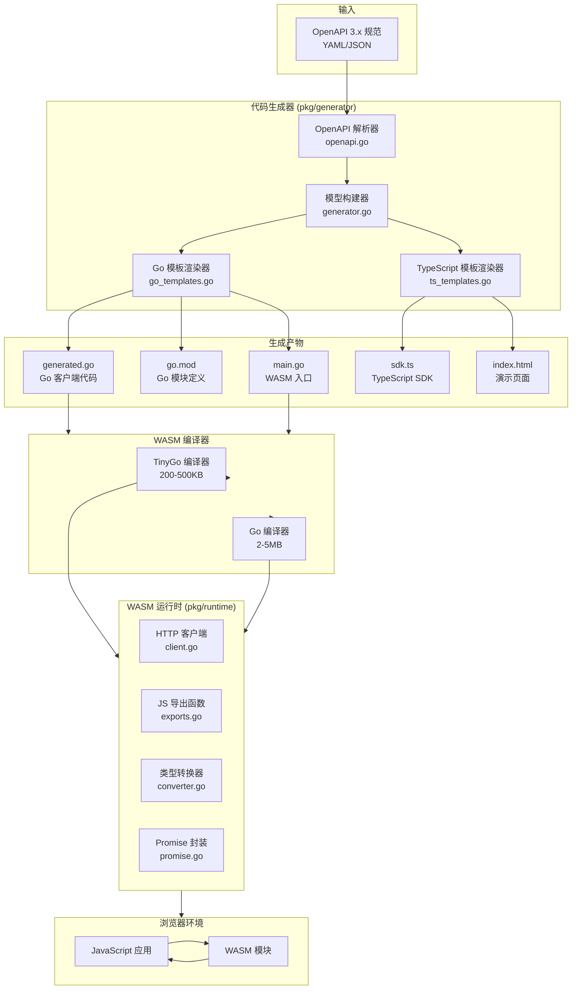
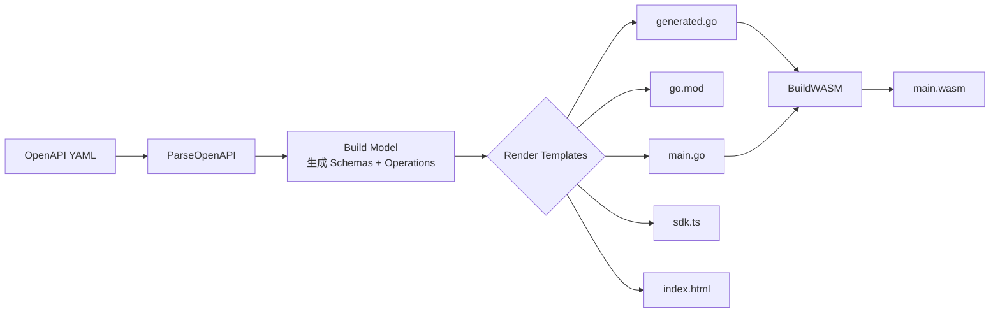
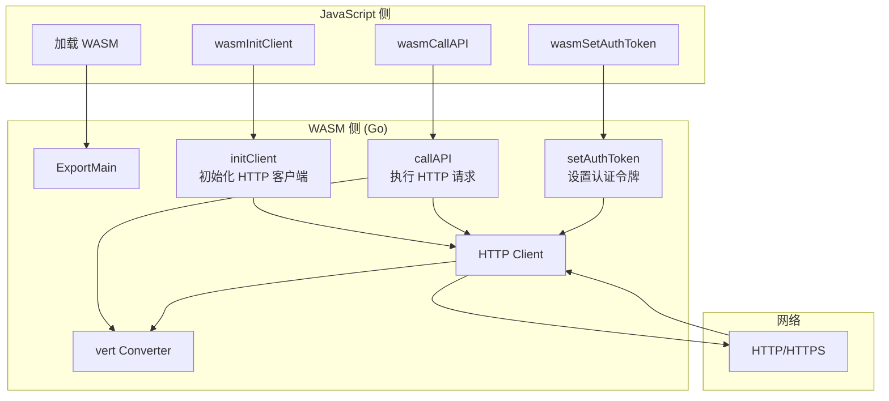
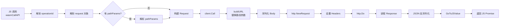
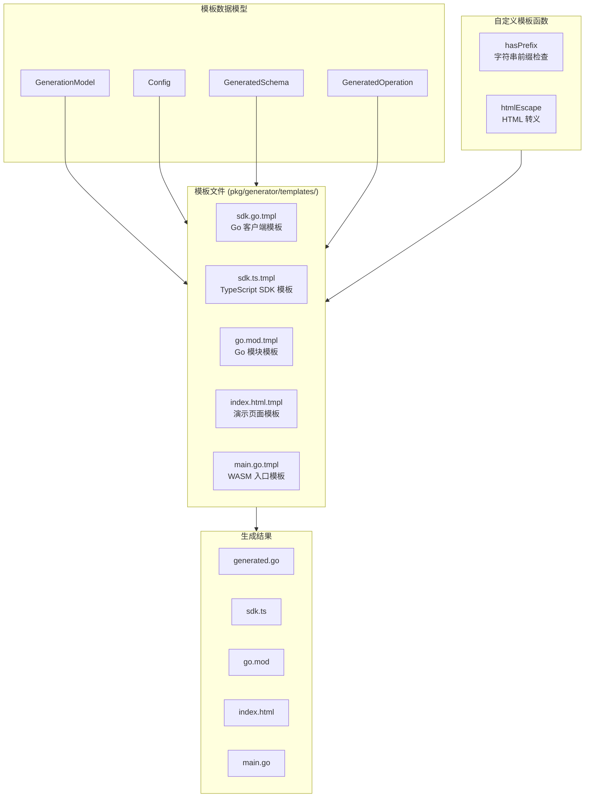
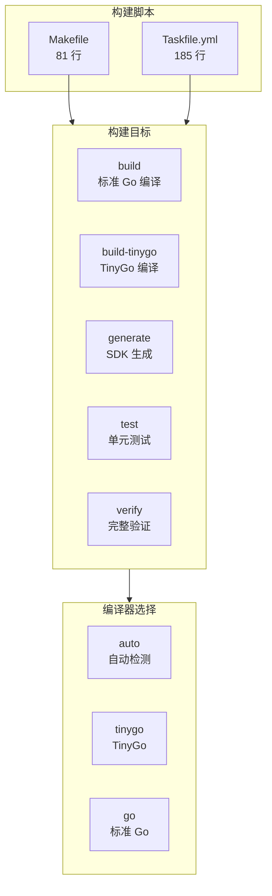

# 架构设计文档

## 系统概述

`go_wasm_lib2` (模块路径: `github.com/fred29910/gowasm`) 是一个基于 Go 的 WebAssembly (WASM) HTTP SDK 生成器。它能够为 OpenAPI 3.x 规范自动生成类型安全的客户端 SDK，并编译为可在浏览器中运行的 WASM 模块。

## 系统架构图



## 核心组件说明

### 1. CLI 入口 (`cmd/generator/`)

| 文件 | 行数 | 职责 |
|------|------|------|
| `main.go` | 341 | CLI 应用入口，定义 `generate` 和 `init` 子命令 |

**支持的子命令：**

| 命令 | 用途 |
|------|------|
| `generate` | 从 OpenAPI 规范生成 SDK |
| `init` | 创建示例项目结构 |

### 2. WASM 运行时入口 (`cmd/runtime/`)

| 文件 | 行数 | 职责 |
|------|------|------|
| `main.go` | 9 | WASM 模块入口，调用 `runtime.ExportMain()` |

### 3. 代码生成器 (`pkg/generator/`)

| 文件 | 行数 | 职责 |
|------|------|------|
| `generator.go` | 563 | 核心生成逻辑：模型构建、编排 |
| `openapi.go` | 194 | OpenAPI 3.x 解析器 |
| `types.go` | 126 | 类型定义和命名转换 |
| `go_templates.go` | 126 | Go 模板渲染逻辑 |
| `ts_templates.go` | 271 | TypeScript 模板渲染逻辑 |

### 4. WASM 运行时核心 (`pkg/runtime/`)

| 文件 | 行数 | 职责 |
|------|------|------|
| `client.go` | 292 | HTTP 客户端实现 |
| `exports.go` | 361 | JavaScript 导出函数 |
| `promise.go` | 95 | Promise 封装 |
| `converter.go` | 296 | Go ↔ JS 类型转换 |
| `error.go` | 109 | 错误类型和错误码定义 |
| `build.go` | 138 | WASM 构建工具 |

## 数据流图

### 1. 代码生成流程



### 2. WASM 运行时流程



### 3. 请求处理流程



## 模板系统架构



## 并发安全设计

```mermaid
flowchart LR
    subgraph Threads["并发场景"]
        T1[JS 主线程<br/>wasmSetAuthToken]
        T2[Go goroutine<br/>wasmCallAPI]
    end

    subgraph Lock["同步机制"]
        M[sync.RWMutex<br/>HTTPClient.mu]
    end

    subgraph Shared["共享状态"]
        S1[config.Headers<br/>map[string]string]
    end

    T1 -->|Lock| M
    T2 -->|RLock| M
    M --> S1
```

## 构建系统架构



## 文件清单

```
go_wasm_lib2/
├── cmd/
│   ├── generator/
│   │   └── main.go              # CLI 入口 (341 行)
│   └── runtime/
│       └── main.go              # WASM 入口 (9 行)
├── pkg/
│   ├── generator/
│   │   ├── generator.go         # 核心生成逻辑 (563 行)
│   │   ├── openapi.go           # OpenAPI 解析 (194 行)
│   │   ├── types.go             # 类型定义 (126 行)
│   │   ├── go_templates.go      # Go 模板渲染 (126 行)
│   │   ├── ts_templates.go      # TS 模板渲染 (271 行)
│   │   └── templates/           # 模板文件
│   │       ├── sdk.go.tmpl
│   │       ├── sdk.ts.tmpl
│   │       ├── go.mod.tmpl
│   │       ├── index.html.tmpl
│   │       └── main.go.tmpl
│   └── runtime/
│       ├── client.go            # HTTP 客户端 (292 行)
│       ├── exports.go           # JS 导出 (361 行)
│       ├── promise.go           # Promise 封装 (95 行)
│       ├── converter.go         # 类型转换 (296 行)
│       ├── error.go             # 错误定义 (109 行)
│       └── build.go             # 构建工具 (138 行)
├── version/
│   └── version.go               # 版本信息
├── examples/
│   ├── petstore/
│   │   ├── openapi.yaml         # Petstore 示例规范
│   │   └── generated/           # 生成的 SDK
│   └── templates/               # 自定义模板示例
├── Makefile                     # Make 构建脚本
├── Taskfile.yml                 # Task 构建脚本
├── go.mod                       # Go 模块定义
└── package.json                 # npm 配置 (oxlint)
```
