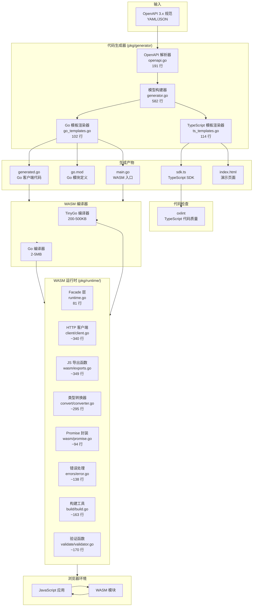
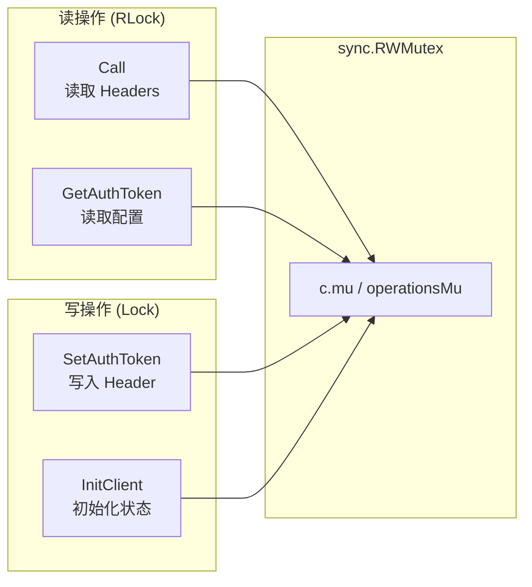
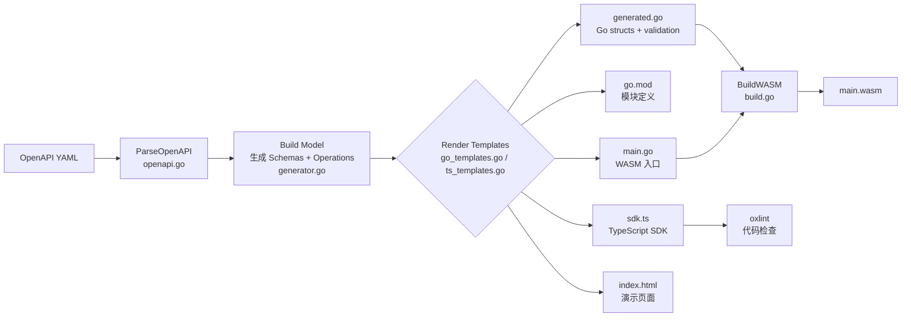
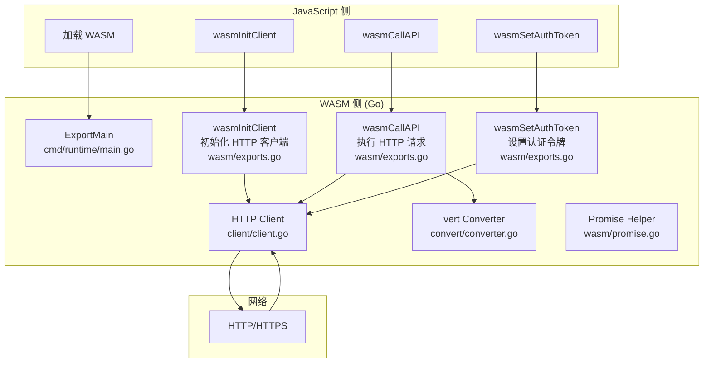
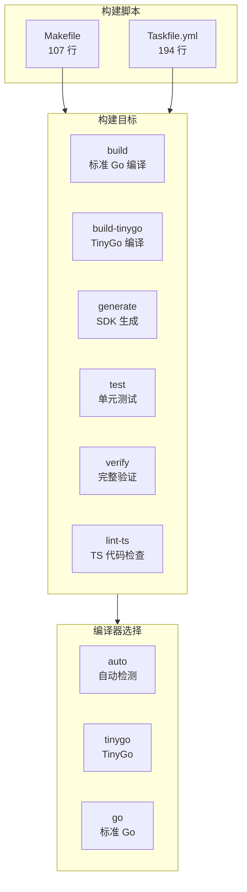

# 架构设计文档

## 系统概述

`go_wasm_lib2` (模块路径: `github.com/fred29910/gowasm`) 是一个基于 Go 的 WebAssembly (WASM) HTTP SDK 生成器。它能够为 OpenAPI 3.x 规范自动生成类型安全的客户端 SDK，并编译为可在浏览器中运行的 WASM 模块。

## 系统架构图



## 核心组件说明

### 1. CLI 入口 (`cmd/generator/`)

| 文件 | 行数 | 职责 |
|------|------|------|
| `main.go` | 73 | CLI 应用入口，app 装配，ExitErrHandler |
| `flags.go` | 81 | generate 命令的 flag 定义 |
| `generate.go` | 131 | runGenerate 逻辑 |
| `init.go` | 22 | runInit 逻辑 |
| `wasm.go` | 32 | runBuildWASM 逻辑 |
| `lint.go` | 34 | runOxlint 逻辑 |

**支持的子命令：**

| 命令 | 用途 |
|------|------|
| `generate` | 从 OpenAPI 规范生成 SDK |
| `init` | 创建示例项目结构 |
| `version` | 显示版本信息 |

### 2. WASM 运行时入口 (`cmd/runtime/`)

| 文件 | 行数 | 职责 |
|------|------|------|
| `main.go` | 8 | WASM 模块入口，调用 `runtime.ExportMain()` |

### 3. 代码生成器 (`pkg/generator/`)

| 文件 | 行数 | 职责 |
|------|------|------|
| `generator.go` | 582 | 核心生成逻辑：模型构建、编排 |
| `openapi.go` | 191 | OpenAPI 3.x 解析器 |
| `types.go` | 200 | 类型定义和命名转换（含缩写词表：ID, URL, HTTP...） |
| `go_templates.go` | 102 | Go 模板渲染逻辑 |
| `ts_templates.go` | 114 | TypeScript 模板渲染逻辑 |

### 4. WASM 运行时核心 (`pkg/runtime/`)

| 文件 | 行数 | 职责 |
|------|------|------|
| `runtime.go` | 81 | Facade 层，重新导出所有子包符号（向后兼容） |
| `client/client.go` | ~340 | HTTP 客户端实现（含 path param 校验、resolvePath 错误返回） |
| `client/client_test.go` | ~224 | 客户端测试（resolvePath、nil Headers 保护等） |
| `errors/error.go` | ~138 | WASMError 类型、错误码、WrapWASMError |
| `validate/validator.go` | ~170 | 共享验证函数（email/uuid/datetime(RFC3339)/enum） |
| `convert/converter.go` | ~295 | Go ↔ JavaScript 类型转换（js/wasm only，含原型污染防护） |
| `wasm/exports.go` | ~349 | JavaScript 导出函数（init/callAPI/auth/getConfig） |
| `wasm/promise.go` | ~94 | Promise 封装（含 recover 保护、完整错误字段） |
| `build/build.go` | ~163 | WASM 构建工具（含 context timeout） |
| `build/build_test.go` | ~154 | 构建测试 |

### 5. 内置模板 (`pkg/generator/templates/`)

| 模板文件 | 行数 | 输出文件 | 用途 |
|----------|------|----------|------|
| `sdk.go.tmpl` | 167 | `generated.go` | Go 客户端代码：schema 结构体、请求/响应类型、验证方法、辅助函数 |
| `sdk.ts.tmpl` | 170 | `sdk.ts` | TypeScript SDK：接口定义、WASMSDK 类、类型化 API 函数 |
| `go.mod.tmpl` | 7 | `go.mod` | Go 模块定义 |
| `main.go.tmpl` | 11 | `main.go` | WASM 入口文件 |
| `index.html.tmpl` | 769 | `index.html` | 交互式演示页面（Tailwind CSS） |

### 6. 构建系统

| 文件 | 行数 | 职责 |
|------|------|------|
| `Makefile` | 107 | GNU Make 构建系统 |
| `Taskfile.yml` | 194 | Task runner 构建系统（跨平台） |

## 安全架构

### 原型污染防护

`converter.go` 在解析 JavaScript 对象时自动过滤危险键：

```go
var dangerousJSKeys = map[string]bool{
    "__proto__": true, "constructor": true, "prototype": true,
    "__defineGetter__": true, "__defineSetter__": true, "__lookupGetter__": true,
    "__lookupSetter__": true, "hasOwnProperty": true, "isPrototypeOf": true,
    "propertyIsEnumerable": true, "toLocaleString": true, "toString": true, "valueOf": true,
}
```

### 路径遍历防护

`client.go` 的 `ResolvePath` 使用正则表达式 `\{([^}]+)\}` 进行确定性的单次替换，避免了 map 遍历顺序随机导致的参数注入漏洞。`safePathParam` 检测并拒绝：
- 包含 `..` 的路径值
- 包含 `//` 的路径值
- 以 `/` 开头的路径值

### OOM 防护

`client.go` 的 `Call` 方法使用 `io.LimitReader(resp.Body, 10<<20)` 限制响应体最大读取 10 MB，防止恶意服务端返回超大报文导致 WASM 内存溢出。

### 并发安全

| 组件 | 保护机制 | 保护对象 |
|------|----------|----------|
| `HTTPClient` | `sync.RWMutex` (c.mu) | `config.Headers` 读写、初始化状态 |
| `operations` 注册表 | `sync.RWMutex` (operationsMu) | 操作处理函数的并发注册与查找 |
| `WASMExports` | `sync.RWMutex` (e.mu) | 客户端初始化状态的读写 |



### 结构化错误处理

`error.go` 的 `WASMError` 包含丰富的上下文信息，并通过 `runtime.Caller` 自动捕获调用位置，支持 `Unwrap()` 以兼容 `errors.Is`/`errors.As`：

```go
type WASMError struct {
    Code       string `json:"code"`       // 错误码，如 "TIMEOUT"
    Message    string `json:"message"`    // 人类可读的错误描述
    Details    string `json:"details"`    // 底层错误详情
    FilePath   string `json:"filePath"`   // 出错源文件（自动捕获）
    LineNumber int    `json:"lineNumber"` // 出错行号（自动捕获）
    Suggestion string `json:"suggestion"` // 修复建议
}
```

## 数据流图

### 1. 代码生成流程



### 2. WASM 运行时流程



### 3. 请求处理流程

```mermaid
flowchart LR
    A[JS 调用<br/>wasmCallAPI] --> B[解析 operationId]
    B --> C[解析 request 对象]
    C --> D[解析 pathParams → map]
    C --> E[解析 query → url.Values]
    C --> F[解析 headers → map]
    C --> G[解析 body → interface{}]
    D --> H[构建 Request 结构体]
    E --> H
    F --> H
    G --> H
    H --> I[client.Call]
    I --> J[buildURL<br/>url.JoinPath 拼接基础 URL + 正则替换路径参数]
    J --> K[序列化 Body]
    K --> L[http.NewRequest]
    M --> N[http.Do]
    N --> O[读取 Response<br/>LimitReader 10MB 上限]
    O --> P[JSON 反序列化]
    P --> Q[GoToJSValue]
    Q --> R[返回 JS Promise]
```

## 构建系统架构



## 文件清单

```
go_wasm_lib2/
├── cmd/
│   ├── generator/
│   │   ├── main.go              # CLI 入口 (73 行)
│   │   ├── flags.go             # Flag 定义 (81 行)
│   │   ├── generate.go          # runGenerate 逻辑 (131 行)
│   │   ├── init.go              # runInit 逻辑 (22 行)
│   │   ├── wasm.go              # runBuildWASM 逻辑 (32 行)
│   │   └── lint.go              # runOxlint 逻辑 (34 行)
│   └── runtime/
│       └── main.go              # WASM 入口 (9 行)
├── pkg/
│   ├── generator/
│   │   ├── generator.go         # 核心生成逻辑
│   │   ├── openapi.go           # OpenAPI 解析
│   │   ├── types.go             # 类型定义
│   │   ├── go_templates.go      # Go 模板渲染
│   │   ├── ts_templates.go      # TS 模板渲染
│   │   ├── generator_test.go    # 生成器测试
│   │   ├── openapi_test.go      # 解析器测试
│   │   └── types_test.go        # 类型测试
│   │   └── templates/           # 模板文件
│   │       ├── sdk.go.tmpl      # Go 客户端模板
│   │       ├── sdk.ts.tmpl      # TypeScript SDK 模板
│   │       ├── go.mod.tmpl      # Go 模块模板
│   │       ├── index.html.tmpl  # 演示页面模板
│   │       └── main.go.tmpl     # WASM 入口模板
│   └── runtime/
│       ├── runtime.go           # Facade 层（重新导出子包符号）
│       ├── client/
│       │   ├── client.go        # HTTP 客户端
│       │   └── client_test.go   # 客户端测试
│       ├── errors/
│       │   └── error.go         # WASMError 类型
│       ├── validate/
│       │   └── validator.go     # 共享验证函数
│       ├── convert/
│       │   └── converter.go     # JS/Go 类型转换 (js/wasm)
│       ├── wasm/
│       │   ├── exports.go       # JS 导出函数 (js/wasm)
│       │   └── promise.go       # Promise 封装 (js/wasm)
│       └── build/
│           ├── build.go         # WASM 构建工具
│           └── build_test.go    # 构建测试
├── version/
│   └── version.go               # 版本信息
├── examples/
│   └── petstore/
│       ├── openapi.yaml         # Petstore 示例规范
│       └── generated/           # 生成的示例代码
├── docs/                        # 文档目录
├── Makefile                     # Make 构建脚本
├── Taskfile.yml                 # Task 构建脚本
├── go.mod                       # Go 模块定义
└── oxlintrc.json                # oxlint 配置
```
