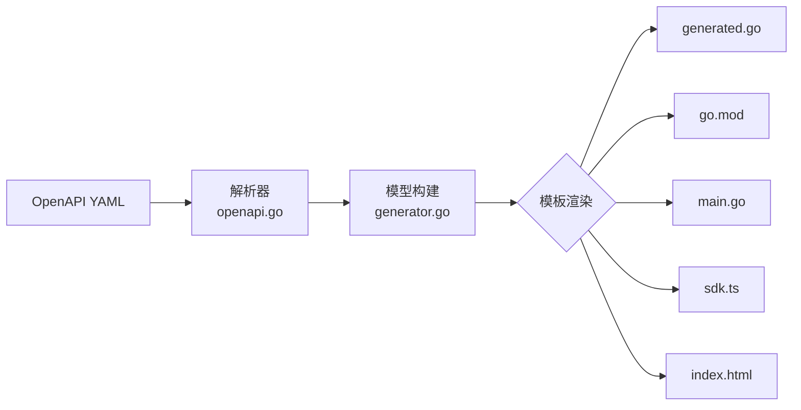

# 生成器 API 文档

## 概述

代码生成器 (`pkg/generator/`) 负责解析 OpenAPI 3.x 规范，并生成以下产物：



## 内置模板

模板文件通过 `go:embed` 嵌入到二进制中，位于 `pkg/generator/templates/` 目录：

| 模板文件 | 行数 | 输出文件 | 用途 |
|----------|------|----------|------|
| `sdk.go.tmpl` | 295 | `generated.go` | Go 客户端：schema 结构体、请求/响应类型、验证方法、辅助函数 |
| `sdk.ts.tmpl` | 170 | `sdk.ts` | TypeScript SDK：接口定义、WASMSDK 类、类型化 API 函数 |
| `go.mod.tmpl` | 7 | `go.mod` | Go 模块定义 |
| `main.go.tmpl` | 11 | `main.go` | WASM 入口文件 |
| `index.html.tmpl` | 66 | `index.html` | 交互式演示页面（Tailwind CSS） |

### 自定义模板

通过 CLI 标志使用自定义模板文件覆盖内置模板：

```bash
gowasm-generator generate \
  -s openapi.yaml \
  -o ./output \
  --go-template ./my-go.tmpl \
  --ts-template ./my-ts.tmpl
```

> 自定义模板使用 Go 标准库 `text/template` 语法，可以访问与内置模板完全相同的数据模型和函数。

## 模板引擎

使用 Go 标准库 `text/template`，支持：

- 条件渲染: `{{if .Condition}}...{{end}}`
- 循环渲染: `{{range .Items}}...{{end}}`
- 变量插值: `{{.VariableName}}`
- 模板函数: `{{hasPrefix .Type "[]"}}`

## 模板数据模型

### GenerationModel (根数据)

```go
type GenerationModel struct {
    Doc           *OpenAPI              // 解析后的 OpenAPI 文档
    Config        *Config               // 生成器配置
    InfoTitle     string                // API 标题
    InfoVersion   string                // API 版本
    BaseURL       string                // 默认服务器 URL
    Schemas       []GeneratedSchema     // 所有 schema 定义
    Operations    []GeneratedOperation  // 所有 operation 定义
    OperationIDs  []string              // 排序后的 operation ID 列表
    Validation    bool                  // 是否启用验证
}
```

### Config (配置)

```go
type Config struct {
    ModuleName     string  // Go 模块名
    OutputModule   string  // 输出模块路径
    Package        string  // Go 包名
    RuntimePath    string  // runtime 模块本地路径
    RuntimeImport  string  // runtime 包导入路径
    Validation     bool    // 是否生成验证方法
    GoTemplatePath string  // 自定义 Go 模板路径
    TSTemplatePath string  // 自定义 TS 模板路径
}
```

### GeneratedSchema (生成的 Schema)

```go
type GeneratedSchema struct {
    Name       string              // 原始 schema 名
    GoName     string              // Go 标识符名 (PascalCase)
    TSName     string              // TypeScript 标识符名
    Properties []GeneratedProperty // 属性列表
}
```

### GeneratedProperty (生成的属性)

```go
type GeneratedProperty struct {
    Name       string        // 原始属性名
    GoName     string        // Go 字段名
    TSName     string        // TypeScript 字段名
    GoType     string        // Go 类型
    TSType     string        // TypeScript 类型
    Required   bool          // 是否必需
    EnumValues []interface{} // 枚举值
    Format     string        // 格式提示 (email, uuid, date-time)
}
```

### GeneratedOperation (生成的操作)

```go
type GeneratedOperation struct {
    ID                  string                // Operation ID
    TSName              string                // TypeScript 函数名
    Method              string                // HTTP 方法
    Path                string                // 请求路径
    Summary             string                // 操作摘要
    RequestStructName   string                // Go 请求结构体名
    RequestInterface    string                // Go 请求接口名
    ResponseStructName  string                // Go 响应结构体名
    ResponseInterface   string                // Go 响应接口名
    PathParams          []GeneratedParameter  // 路径参数
    QueryParams         []GeneratedParameter  // 查询参数
    HasBody             bool                  // 是否有请求体
    BodyType            string                // 请求体 Go 类型
    ResponseType        string                // 主要响应 Go 类型
    BodyParamName       string                // 请求体参数名
    Responses           []GeneratedResponse   // 所有响应
}
```

### GeneratedParameter (生成的参数)

```go
type GeneratedParameter struct {
    Name       string        // 参数名
    GoName     string        // Go 字段名
    TSName     string        // TypeScript 字段名
    GoType     string        // Go 类型
    TSType     string        // TypeScript 类型
    In         string        // "path" 或 "query"
    Required   bool          // 是否必需
    EnumValues []interface{} // 枚举值
    Format     string        // 格式提示
}
```

### GeneratedResponse (生成的响应)

```go
type GeneratedResponse struct {
    Code        string  // HTTP 状态码
    GoType      string  // 响应体 Go 类型
    TSType      string  // 响应体 TypeScript 类型
    Description string  // 响应描述
    Primary     bool    // 是否为主要 (2xx) 响应
    StructName  string  // Go 响应结构体名
}
```

## 自定义模板函数

| 函数 | 签名 | 说明 |
|------|------|------|
| `hasPrefix` | `hasPrefix(s, prefix string) bool` | 检查字符串前缀 |
| `htmlEscape` | `htmlEscape(s string) string` | HTML 实体转义 |

## 生成代码示例

### 生成的 Go 代码结构

```go
// Code generated by github.com/fred29910/gowasm/cmd/generator. DO NOT EDIT.

package generated

import (
    "context"
    "fmt"
    "net/url"
    "reflect"
    "strconv"

    runtime "github.com/fred29910/gowasm/pkg/runtime"
)

// Schema 结构体
type Pet struct {
    ID     int64  `json:"id,omitempty"`
    Name   string `json:"name"`
    Status string `json:"status,omitempty"`
}

// Request 结构体
type GetPetByIdRequest struct {
    PetId      int64             `json:"petId"`
    PathParams map[string]string `json:"pathParams,omitempty"`
    Query      url.Values        `json:"query,omitempty"`
    Headers    map[string]string `json:"headers,omitempty"`
}

// Response 结构体
type GetPetByIdResponse struct {
    Data *Pet `json:"data,omitempty"`
}

// 请求转换函数
func GetPetByIdRequestToRequest(params GetPetByIdRequest) runtime.Request {
    pathParams := make(map[string]string)
    pathParams["petId"] = int64ToString(params.PetId)
    return runtime.Request{
        Method:     "GET",
        Path:       "/pet/{petId}",
        PathParams: pathParams,
        Query:      copyValues(params.Query),
        Headers:    copyStringMap(params.Headers),
    }
}

// 调用函数
func GetPetByIdRequestCall(ctx context.Context, params GetPetByIdRequest) (*runtime.Response, error) {
    req := GetPetByIdRequestToRequest(params)
    return runtime.DefaultClient.Call(ctx, &req)
}

// 验证方法 (如果 --validation=true)
func (r GetPetByIdRequest) Validate() error {
    if r.PetId == int64(0) {
        return fmt.Errorf("petId is required")
    }
    return nil
}

// init 注册操作
func init() {
    runtime.RegisterOperation("getPetById", func(ctx context.Context, req runtime.Request) (*runtime.Response, error) {
        return runtime.DefaultClient.Call(ctx, &req)
    })
}

// 辅助函数
func stringToString(v string) string { return v }
func int64ToString(v int64) string { return strconv.FormatInt(v, 10) }
```

### 生成的 TypeScript 代码结构

```typescript
// Code generated by github.com/fred29910/gowasm/cmd/generator. DO NOT EDIT.

export interface Pet {
    id?: number;
    name: string;
    status?: 'available' | 'pending' | 'sold';
}

export interface GetPetByIdRequest {
    petId: number;
    pathParams?: Record<string, string>;
    query?: Record<string, string>;
    headers?: Record<string, string>;
}

export interface GetPetByIdResponse {
    data?: Pet;
}

export interface WASMConfig {
    baseUrl: string;
    timeout?: number;
    headers?: Record<string, string>;
    credentials?: RequestCredentials;
}

export class WASMSDK {
    private wasmUrl: string;
    private initialized: boolean = false;

    constructor(wasmUrl?: string) {
        this.wasmUrl = wasmUrl || './main.wasm';
    }

    async load(): Promise<void> { /* ... */ }
    async init(config: WASMConfig): Promise<void> { /* ... */ }
    // ...
}

// 类型化 API 方法
export async function getPetById(params: GetPetByIdRequest): Promise<HTTPResponse> {
    const request: HTTPRequest = {
        method: 'GET',
        path: '/pet/{petId}',
        headers: params.headers || {},
        query: params.query || {},
        pathParams: {
            'petId': String(params.petId),
        },
    };
    return (window as any).wasmCallAPI('getPetById', request);
}
```

## 类型映射

### Go 类型 → TypeScript 类型

```mermaid
flowchart LR
    subgraph Go["Go 类型"]
        G1[string]
        G2[int/int64]
        G3[float64]
        G4[bool]
        G5[[]T]
        G6[map[K]V]
        G7[struct]
    end

    subgraph TS["TypeScript 类型"]
        T1[string]
        T2[number]
        T3[number]
        T4[boolean]
        T5[Array<T>]
        T6[Record<K, V>]
        T7[interface]
    end

    G1 --> T1
    G2 --> T2
    G3 --> T3
    G4 --> T4
    G5 --> T5
    G6 --> T6
    G7 --> T7
```

### OpenAPI 类型 → Go/TypeScript 映射

| OpenAPI 类型 | Go 类型 | TypeScript 类型 |
|--------------|---------|-----------------|
| `string` | `string` | `string` |
| `integer` | `int` | `number` |
| `integer` (int64) | `int64` | `number` |
| `number` | `float64` | `number` |
| `boolean` | `bool` | `boolean` |
| `array` | `[]T` | `Array<T>` |
| `object` | `map[string]interface{}` | `Record<string, any>` |
| `$ref` | 引用类型名 | 引用类型名 |

## 验证方法生成

当 `--validation=true` 时，为每个 Request 结构体生成验证方法：

```go
func (r CreatePetRequest) Validate() error {
    // 检查必填字段
    if r.Body == nil {
        return fmt.Errorf("body is required")
    }
    
    // 检查枚举值
    if !isValidEnum(r.Status, []interface{}{"available", "pending", "sold"}) {
        return fmt.Errorf("status must be one of: available, pending, sold")
    }
    
    // 检查格式
    if !isValidEmail(r.Email) {
        return fmt.Errorf("email must be a valid email")
    }
    
    return nil
}
```

### 支持的验证规则

| 规则 | 说明 | 触发条件 |
|------|------|----------|
| 必填检查 | 确保字段不为零值 | `required: true` |
| 枚举检查 | 确保字段值在允许列表中 | `enum: [...]` |
| Email 格式 | 简单的 email 格式验证 | `format: email` |
| UUID 格式 | UUID 格式验证 | `format: uuid` |
| DateTime 格式 | ISO 8601 日期时间验证 | `format: date-time` |
| Date 格式 | ISO 8601 日期验证 | `format: date` |

## Dry Run 模式

使用 `--dry-run` 标志可以预览将要生成的文件，而不实际写入：

```bash
gowasm-generator generate -s openapi.yaml -o ./output --dry-run
```

输出：

```
Dry run: files that would be generated:
  generated.go (4523 bytes)
  go.mod (156 bytes)
  sdk.ts (3421 bytes)
  index.html (2156 bytes)

Total: 4 file(s), 10256 bytes
```

## JSON 输出模式

使用 `--output json` 获取机器可读的输出：

```json
{
  "success": true,
  "files": [
    { "path": "generated.go", "size": 4523 },
    { "path": "go.mod", "size": 156 },
    { "path": "main.go", "size": 89 },
    { "path": "sdk.ts", "size": 3421 },
    { "path": "index.html", "size": 2156 }
  ],
  "totalSize": 10345,
  "duration": 1250
}
```

适用于 CI/CD 集成和自动化流程。
