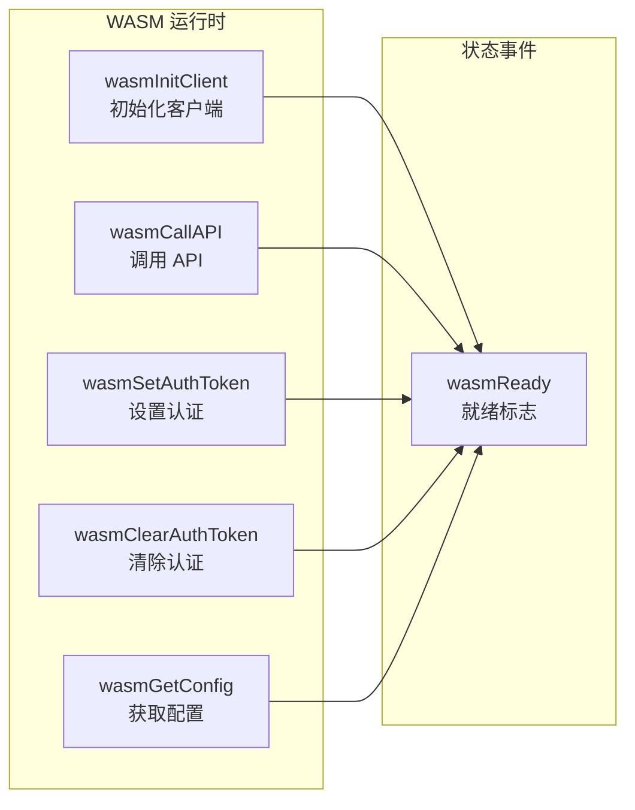
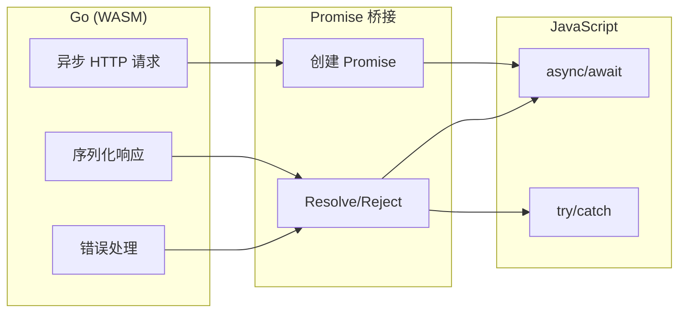

# 运行时 API 文档

## WASM 导出函数

当 WASM 模块加载完成后，以下函数会被注册到 `window` 全局对象上，供 JavaScript 调用。

### 函数概览



### window.wasmInitClient(config: WASMConfig): Promise

初始化 HTTP 客户端配置。

#### 参数

| 参数 | 类型 | 必需 | 说明 |
|------|------|------|------|
| `config` | `WASMConfig` | ✅ | 客户端配置对象 |

#### WASMConfig 接口

```typescript
interface WASMConfig {
  baseUrl: string;                    // API 基础 URL
  timeout?: number;                   // 请求超时时间（秒），默认 30
  headers?: Record<string, string>;   // 默认请求头
  credentials?: 'include' | 'omit' | 'same-origin'; // 凭据模式
}
```

#### 返回值

返回 `Promise<{ success: boolean, message: string }>`。

#### 示例

```javascript
const result = await window.wasmInitClient({
  baseUrl: 'https://api.example.com',
  timeout: 30,
  headers: { 'Content-Type': 'application/json' },
  credentials: 'same-origin'
});

console.log(result.message); // "Client initialized successfully"
```

#### 错误处理

失败时 Promise 会 reject，返回包含错误码的 Error 对象：

```javascript
try {
  await window.wasmInitClient(null);
} catch (err) {
  console.log(err.code);    // "INVALID_CONFIG"
  console.log(err.message); // "Expected config object"
}
```

### window.wasmCallAPI(operationId: string, request: HTTPRequest): Promise

执行 HTTP 请求。

#### 参数

| 参数 | 类型 | 必需 | 说明 |
|------|------|------|------|
| `operationId` | `string` | ✅ | 操作 ID（OpenAPI operationId） |
| `request` | `HTTPRequest` | ✅ | 请求对象 |

> **operationId 路由**: `callAPI` 会先通过 `GetOperation(operationID)` 查找已注册的自定义处理函数。如果找到，则执行该处理函数（可用于类型安全验证）；否则回退到通用的 `client.Call`。

#### HTTPRequest 接口

```typescript
interface HTTPRequest {
  method: string;                        // HTTP 方法: GET, POST, PUT, DELETE, PATCH
  path: string;                          // 请求路径，如 /users/{id}
  pathParams?: Record<string, string>;   // 路径参数，如 { id: '123' }
  headers?: Record<string, string>;      // 请求头
  query?: Record<string, string>;         // 查询参数
  body?: any;                            // 请求体（自动 JSON 序列化）
}
```

#### 返回值

返回 `Promise<HTTPResponse>`。

```typescript
interface HTTPResponse {
  status: number;                     // HTTP 状态码
  headers: Record<string, string>;    // 响应头
  body: any;                          // 响应体（自动 JSON 反序列化）
  error?: WASMError;                  // 错误信息（如果有）
}
```

#### 示例

```javascript
// GET 请求带路径参数
const response = await window.wasmCallAPI('getPetById', {
  method: 'GET',
  path: '/pet/{petId}',
  pathParams: { petId: '123' }
});

console.log(response.status); // 200
console.log(response.body);   // { id: 123, name: 'Fluffy', ... }

// POST 请求带请求体
const createResponse = await window.wasmCallAPI('createPet', {
  method: 'POST',
  path: '/pet',
  body: { name: 'Fluffy', status: 'available' }
});
```

#### 错误处理

```javascript
try {
  await window.wasmCallAPI('getPetById', {
    method: 'GET',
    path: '/pet/{petId}',
    pathParams: { petId: '123' }
  });
} catch (err) {
  console.log(err.code);    // 如 "NETWORK_ERROR", "TIMEOUT"
  console.log(err.message); // 错误描述
  console.log(err.details); // 详细信息（如果有）
}
```

### window.wasmSetAuthToken(token: string, scheme?: string): Object

设置认证令牌（Bearer Token）。

#### 参数

| 参数 | 类型 | 必需 | 默认值 | 说明 |
|------|------|------|--------|------|
| `token` | `string` | ✅ | - | 认证令牌 |
| `scheme` | `string` | ❌ | `Bearer` | 认证方案 |

#### 返回值

返回同步结果对象：

```javascript
{ success: true }
// 或
{ success: false, error: "错误信息" }
```

#### 示例

```javascript
// 设置 Bearer token
const result = window.wasmSetAuthToken('your-jwt-token');
console.log(result.success); // true

// 设置自定义方案
window.wasmSetAuthToken('api-key', 'ApiKey');
```

### window.wasmClearAuthToken(): Object

清除认证令牌。

#### 返回值

```javascript
{ success: true }
```

#### 示例

```javascript
const result = window.wasmClearAuthToken();
console.log(result.success); // true
```

### window.wasmGetConfig(): Object

获取当前客户端配置。

#### 返回值

```javascript
{
  success: true,
  config: {
    baseUrl: 'https://api.example.com',
    timeout: 30,
    headers: { 'Content-Type': 'application/json' }
  }
}
// 或
{
  success: false,
  error: "错误信息"
}
```

#### 示例

```javascript
const result = window.wasmGetConfig();
if (result.success) {
  console.log('Base URL:', result.config.baseUrl);
  console.log('Timeout:', result.config.timeout);
}
```

### window.wasmReady: boolean

WASM 模块加载完成后会被设置为 `true`。

#### 用法

```javascript
// 等待 WASM 就绪
function waitForWasm() {
  return new Promise((resolve) => {
    const check = () => {
      if (window.wasmReady) {
        resolve();
      } else {
        setTimeout(check, 100);
      }
    };
    check();
  });
}

await waitForWasm();
console.log('WASM is ready!');
```

## WASMError 错误类型

```typescript
interface WASMError {
  code: string;       // 错误码
  message: string;    // 错误消息
  details?: string;   // 详细信息
  filePath?: string;  // 出错源文件（自动捕获）
  lineNumber?: number;// 出错行号（自动捕获）
  suggestion?: string;// 修复建议
}
```

### 错误码列表

| 错误码 | 说明 | 场景 |
|--------|------|------|
| `INVALID_CONFIG` | 配置无效 | 初始化时配置对象无效 |
| `INIT_FAILED` | 初始化失败 | 客户端初始化失败 |
| `NOT_INITIALIZED` | 未初始化 | 调用 API 前未初始化客户端 |
| `INVALID_OPERATION` | 无效操作 | 操作 ID 无效或参数不足 |
| `REQUEST_FAILED` | 请求失败 | HTTP 请求失败 |
| `SERIALIZATION_FAILED` | 序列化失败 | 请求体/响应体序列化失败 |
| `DESERIALIZATION_FAILED` | 反序列化失败 | 响应体反序列化失败 |
| `NETWORK_ERROR` | 网络错误 | 网络连接失败 |
| `TIMEOUT` | 请求超时 | 请求超过配置的超时时间 |

### Go 侧错误处理特性

- **自动捕获调用位置**: 通过 `WrapWASMError()` 和 `runtime.Caller(1)` 自动获取出错文件名和行号，无需硬编码
- **支持 `errors.Is`/`errors.As`**: `WASMError` 实现了 `Unwrap() error` 接口，可与 Go 标准库错误处理生态无缝集成
- **结构化错误**: 通过 `converter.go` 将 `WASMError` 转换为 JavaScript Error 对象，保留 `code`、`details` 等自定义属性

## 安全特性

### 原型污染防护

`converter.go` 在解析 JavaScript 对象时，自动过滤以下危险键：

| 过滤的键 | 原因 |
|----------|------|
| `__proto__` | 可污染 Object.prototype |
| `constructor` | 可篡改对象构造函数 |
| `prototype` | 可修改原型链 |
| `__defineGetter__` / `__defineSetter__` | 可注入恶意 getter/setter |
| `hasOwnProperty` / `isPrototypeOf` / `propertyIsEnumerable` | 可破坏对象方法 |
| `toString` / `valueOf` | 可篡改类型转换行为 |

### 路径遍历防护

`ResolvePath` 使用正则表达式 `\{([^}]+)\}` 进行确定性单次替换（避免 map 遍历顺序随机导致的参数注入），`safePathParam` 检测并拒绝的路径参数值：

| 检测规则 | 示例（被拒绝） | 原因 |
|----------|----------------|------|
| 包含 `..` | `../../etc/passwd` | 目录遍历攻击 |
| 包含 `//` | `//evil.com` | 路径混淆 |
| 以 `/` 开头 | `/absolute/path` | 覆盖基础路径 |

> ⚠️ 检测到非法值时返回空字符串（静默抹除）。建议始终调用 `Validate()` 方法验证输入。

### OOM 防护

`client.go` 的 `Call` 方法使用 `io.LimitReader(resp.Body, 10<<20)` 限制响应体最大读取 **10 MB**，防止恶意服务端返回超大报文导致 WASM 内存溢出。

### URL 安全拼接

`buildURL` 使用 `url.JoinPath()` 进行基础 URL 和路径的安全拼接，自动处理首尾斜杠冲突，避免双斜杠或路径截断问题。

### 并发安全

运行时使用 `sync.RWMutex` 保护三处共享状态：

| 锁变量 | 保护对象 | 读操作 | 写操作 |
|--------|----------|--------|--------|
| `HTTPClient.mu` | `config.Headers` 和 `initialized` | `Call()` 读取 headers | `SetAuthToken()` / `ClearAuthToken()` / `initClient()` |
| `operationsMu` | `operations` 注册表 | `GetOperation()` 查找处理函数 | `RegisterOperation()` 注册处理函数 |
| `WASMExports.mu` | WASM 客户端状态 | `callAPI()` 等读取 `initialized` 和 `client` | `initClient()` 写入 |

## Promise 封装说明

WASM 运行时使用 Promise 封装异步操作，确保：

1. **异步执行**: HTTP 请求在单独的 goroutine 中执行，不阻塞主线程
2. **错误传播**: Go 的 error 被转换为 JavaScript Error 对象
3. **结构化错误**: WASMError 包含错误码、消息和建议



## 类型转换

### 支持的类型映射

| Go 类型 | JavaScript 类型 |
|---------|----------------|
| `string` | `string` |
| `int`, `int64` | `number` |
| `float64` | `number` |
| `bool` | `boolean` |
| `[]T` | `Array` |
| `map[string]T` | `Object` |
| `struct` | `Object` (带 JSON tags) |
| `nil` | `null` |

## 完整使用示例

```html
<!DOCTYPE html>
<html lang="zh-CN">
<head>
  <meta charset="UTF-8">
  <title>WASM API 客户端示例</title>
</head>
<body>
  <h1>API 客户端</h1>
  <button id="loadBtn">加载 WASM</button>
  <button id="initBtn" disabled>初始化</button>
  <button id="callBtn" disabled>调用 API</button>
  <pre id="output"></pre>

  <script>
    const output = document.getElementById('output');
    const loadBtn = document.getElementById('loadBtn');
    const initBtn = document.getElementById('initBtn');
    const callBtn = document.getElementById('callBtn');

    function log(msg) {
      output.textContent += msg + '\n';
    }

    loadBtn.onclick = async () => {
      try {
        const response = await fetch('./main.wasm');
        const bytes = await response.arrayBuffer();
        await WebAssembly.instantiate(bytes);
        log('WASM 加载成功');
        initBtn.disabled = false;
      } catch (err) {
        log('WASM 加载失败: ' + err.message);
      }
    };

    initBtn.onclick = async () => {
      try {
        await window.wasmInitClient({
          baseUrl: 'https://petstore3.swagger.io/api/v3',
          timeout: 30
        });
        log('客户端初始化成功');
        callBtn.disabled = false;
      } catch (err) {
        log('初始化失败: ' + err.message);
      }
    };

    callBtn.onclick = async () => {
      try {
        const response = await window.wasmCallAPI('getPetById', {
          method: 'GET',
          path: '/pet/{petId}',
          pathParams: { petId: '1' }
        });
        log('响应状态: ' + response.status);
        log('响应数据: ' + JSON.stringify(response.body, null, 2));
      } catch (err) {
        log('请求失败: ' + err.message);
      }
    };
  </script>
</body>
</html>
```
